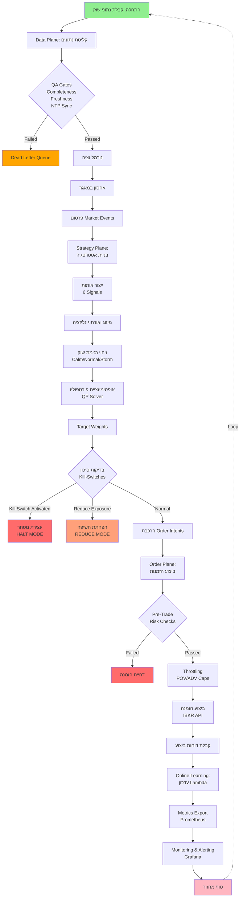
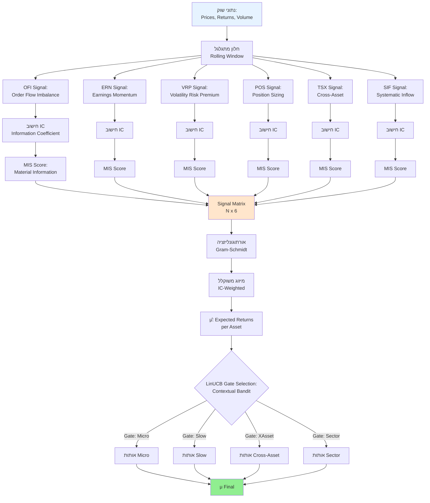
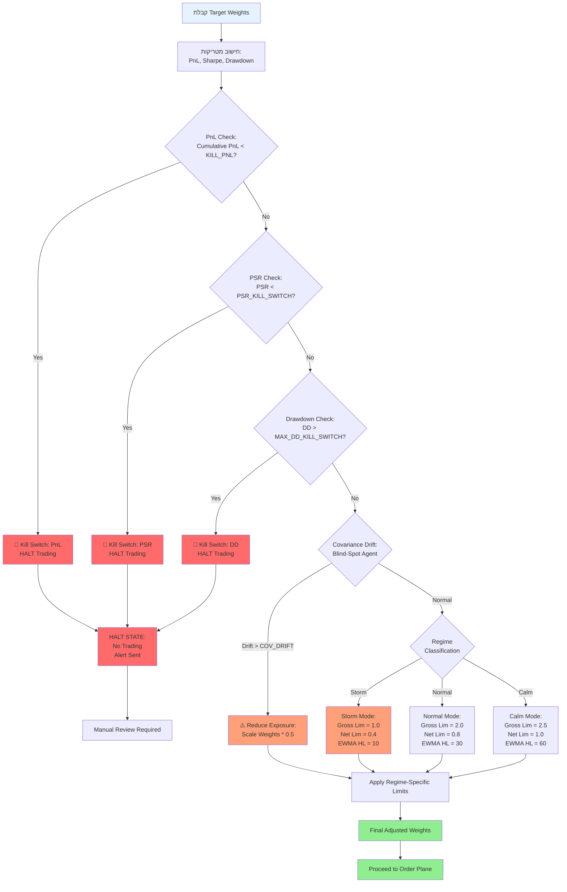
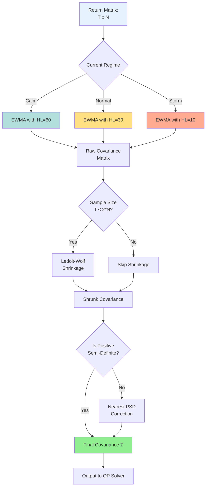
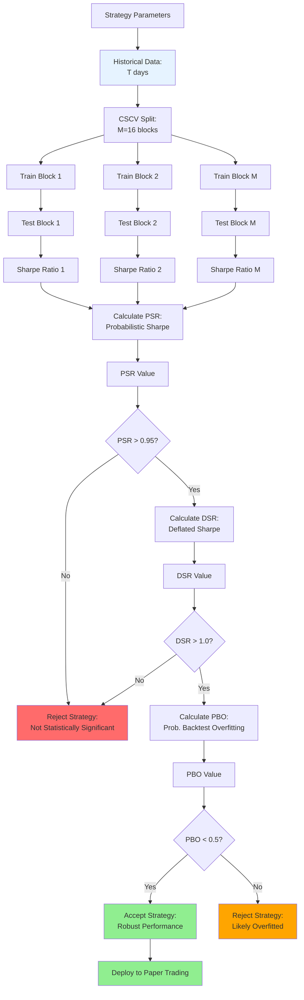
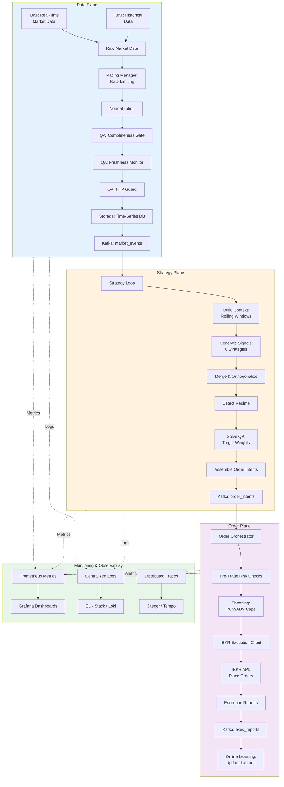

# תרשימי זרימה - לוגיקת קבלת החלטות
## Decision Flow Diagrams

**תאריך:** 28 אוקטובר 2025
**גרסה:** 1.0

---

## 📊 תרשים 1: זרימה כוללת (High-Level Decision Flow)



---

## 🎯 תרשים 2: Signal Generation Flow (ייצור אותות)



---

## ⚙️ תרשים 3: Portfolio Optimization Flow (אופטימיזציית פורטפוליו)

```mermaid
graph TD
    MuInput[μ: Expected Returns] --> QPSetup[הכנת QP Problem]
    SigmaInput[Σ: Covariance Matrix] --> QPSetup
    RegimeInput[Regime: Calm/Normal/Storm] --> QPSetup
    PrevWeights[w_prev: Previous Weights] --> QPSetup

    QPSetup --> Objective[Objective Function:<br/>max μ'w - λ*w'Σw - τ*turnover]

    Objective --> Constraints{Constraints}

    Constraints --> BoxConst[Box Constraints:<br/>-0.25 ≤ w_i ≤ 0.25]
    Constraints --> GrossConst[Gross Exposure:<br/>Σ|w_i| ≤ Gross_Lim]
    Constraints --> NetConst[Net Exposure:<br/>|Σw_i| ≤ Net_Lim]
    Constraints --> SumConst[Sum to 1:<br/>Σw_i = 1.0]

    BoxConst --> Solver[CVXPY Solver:<br/>Convex Optimization]
    GrossConst --> Solver
    NetConst --> Solver
    SumConst --> Solver

    Solver --> CheckFeasible{Solution<br/>Feasible?}
    CheckFeasible -->|No| Fallback[Fallback:<br/>Equal Weights /<br/>Previous Weights]
    CheckFeasible -->|Yes| WTarget[w_target: Target Weights]

    Fallback --> VolTargeting[Volatility Targeting:<br/>Scale to VOL_TARGET]
    WTarget --> VolTargeting

    VolTargeting --> PortVol[Portfolio Volatility:<br/>σ_p = √(w'Σw)]
    PortVol --> CheckVol{σ_p > VOL_TARGET?}

    CheckVol -->|Yes| ScaleDown[Scale Down:<br/>w *= VOL_TARGET / σ_p]
    CheckVol -->|No| Final[w_final: Final Weights]

    ScaleDown --> Final

    Final --> Output[Output to Order Plane]

    style MuInput fill:#E6F3FF
    style SigmaInput fill:#E6F3FF
    style RegimeInput fill:#FFE6CC
    style Final fill:#90EE90
    style Fallback fill:#FFA07A
```

---

## 🛡️ תרשים 4: Risk Management & Kill-Switches (ניהול סיכונים)



---

## 🔄 תרשים 5: Covariance Estimation Flow (אומדן קובריאנס)



---

## 🎰 תרשים 6: LinUCB Contextual Bandit (בחירת Gates)

```mermaid
graph TD
    Context[Market Context:<br/>Regime, Correlation, Vol] --> FeatureVector[Build Feature Vector<br/>x_t ∈ ℝ^d]

    FeatureVector --> Gates{Available Gates}

    Gates --> Gate1[Gate 1: Micro<br/>Fast signals]
    Gates --> Gate2[Gate 2: Slow<br/>Long-term signals]
    Gates --> Gate3[Gate 3: XAsset<br/>Cross-asset signals]
    Gates --> Gate4[Gate 4: Sector<br/>Sector rotation]

    Gate1 --> UCB1[Compute UCB:<br/>θ₁'x + α√(x'A₁⁻¹x)]
    Gate2 --> UCB2[Compute UCB:<br/>θ₂'x + α√(x'A₂⁻¹x)]
    Gate3 --> UCB3[Compute UCB:<br/>θ₃'x + α√(x'A₃⁻¹x)]
    Gate4 --> UCB4[Compute UCB:<br/>θ₄'x + α√(x'A₄⁻¹x)]

    UCB1 --> SelectMax[Select Gate:<br/>arg max UCB_i]
    UCB2 --> SelectMax
    UCB3 --> SelectMax
    UCB4 --> SelectMax

    SelectMax --> SelectedGate[Selected Gate<br/>with highest UCB]

    SelectedGate --> UseSignals[Use Signals<br/>from Selected Gate]

    UseSignals --> Observe[Observe Reward:<br/>r_t = PnL / Vol]

    Observe --> UpdateParams[Update Parameters:<br/>A_i ← A_i + xx'<br/>b_i ← b_i + r·x<br/>θ_i = A_i⁻¹b_i]

    UpdateParams --> NextPeriod[Next Time Period]
    NextPeriod -.->|Loop| Context

    style Context fill:#E6F3FF
    style SelectMax fill:#FFE6CC
    style SelectedGate fill:#90EE90
    style UpdateParams fill:#B2DFDB
```

---

## 📈 תרשים 7: Validation & Overfitting Detection (ולידציה)



---

## 📊 תרשים 8: Execution & Online Learning (ביצוע ולמידה)

```mermaid
graph TD
    OrderIntent[Order Intent:<br/>Asset, Qty, Direction] --> PreTradeRisk{Pre-Trade<br/>Risk Checks}

    PreTradeRisk -->|Failed| RejectOrder[Reject Order:<br/>Log to Metrics]
    PreTradeRisk -->|Passed| CheckPOV{Exceeds POV Cap?<br/>Qty > POV_CAP * Volume}

    CheckPOV -->|Yes| DownScale[Downscale Quantity:<br/>Qty = POV_CAP * Volume]
    CheckPOV -->|No| CheckADV{Exceeds ADV Cap?<br/>Qty > ADV_CAP * ADV}

    DownScale --> CheckADV

    CheckADV -->|Yes| DownScaleADV[Downscale Quantity:<br/>Qty = ADV_CAP * ADV]
    CheckADV -->|No| EstimateCost[Estimate Transaction Cost:<br/>TC = λ * |Qty|^β]

    DownScaleADV --> EstimateCost

    EstimateCost --> PlaceOrder[Place Order:<br/>IBKR API]

    PlaceOrder --> WaitFill[Wait for Fill]

    WaitFill --> ExecReport[Execution Report:<br/>Fill Price, Qty, Time]

    ExecReport --> CalcSlippage[Calculate Realized Slippage:<br/>S = |Fill Price - Expected|]

    CalcSlippage --> UpdateLambda[Update Lambda:<br/>λ_new = ρ*λ_old + (1-ρ)*S/|Qty|^β]

    UpdateLambda --> StoreMetrics[Store Metrics:<br/>Prometheus]

    StoreMetrics --> NextOrder[Ready for Next Order]

    RejectOrder --> AlertRisk[Alert: Risk Violation]

    style OrderIntent fill:#E6F3FF
    style PlaceOrder fill:#FFE6CC
    style UpdateLambda fill:#B2DFDB
    style NextOrder fill:#90EE90
    style RejectOrder fill:#FF6B6B
```

---

## 🏗️ תרשים 9: Architecture - 3 Planes (ארכיטקטורה)



---

## 📝 הסברים נוספים

### סמלים בתרשימים:
- 🟢 **ירוק**: מצב תקין, המשך זרימה
- 🟡 **צהוב**: אזהרה, הפחתת חשיפה
- 🔴 **אדום**: עצירה, Kill-Switch
- 🔵 **כחול**: קלט נתונים
- 🟠 **כתום**: עיבוד ביניים

### מונחים מרכזיים:
- **IC (Information Coefficient)**: מתאם בין אות לתשואות עתידיות
- **MIS (Material Information Score)**: ציון חשיבות האות
- **QP (Quadratic Programming)**: אופטימיזציה קמורה
- **PSR (Probabilistic Sharpe Ratio)**: הסתברות ש-Sharpe > 0
- **DSR (Deflated Sharpe Ratio)**: Sharpe מתוקן למבחנים מרובים
- **PBO (Probability of Backtest Overfitting)**: הסתברות ל-overfitting
- **UCB (Upper Confidence Bound)**: גבול בטחון עליון (LinUCB)
- **EWMA (Exponentially Weighted Moving Average)**: ממוצע משוקלל מעריכי
- **PSD (Positive Semi-Definite)**: מטריצה חיובית-חצי-מוגדרת

---

## 🎯 נתיבי החלטה קריטיים

### נתיב 1: מצב תקין (Normal Flow)
```
נתונים → QA → אותות → אופטימיזציה → בדיקות סיכון [OK] → ביצוע → למידה
```

### נתיב 2: Kill-Switch (Emergency Halt)
```
נתונים → ... → בדיקות סיכון [FAILED] → HALT → התראה → בדיקה ידנית
```

### נתיב 3: Regime Storm (High Volatility)
```
נתונים → זיהוי רגימה [Storm] → הפחתת מגבלות → EWMA מהיר → המשך זהיר
```

### נתיב 4: Blind-Spot Detection (Covariance Drift)
```
נתונים → זיהוי סטייה בקובריאנס → הפחתת חשיפה ב-50% → המשך
```

---

**נוצר על ידי:** Claude Code (AI Assistant)
**תאריך:** 28 אוקטובר 2025
**לשימוש:** צוות הפיתוח, מנהלים, stakeholders

---

## 📌 הערות לקריאה

1. **תרשימי Mermaid** ניתנים לצפייה ב-GitHub, GitLab, Obsidian, ו-VS Code (עם extension)
2. לצפייה מקוונת: [Mermaid Live Editor](https://mermaid.live)
3. ניתן לייצא לתמונות PNG/SVG דרך Mermaid CLI
4. התרשימים מעודכנים נכון למצב הקוד ב-28 אוקטובר 2025

---

## 🔄 עדכונים עתידיים

כאשר הקוד משתנה, יש לעדכן תרשימים אלה:
- [ ] הוספת Multi-Broker Support (Alpaca, Tradier)
- [ ] הוספת Real-Time News Sentiment Analysis
- [ ] הוספת Machine Learning Signals (Deep Learning)
- [ ] הוספת Multi-Currency Support
- [ ] הוספת Options & Derivatives Strategies
